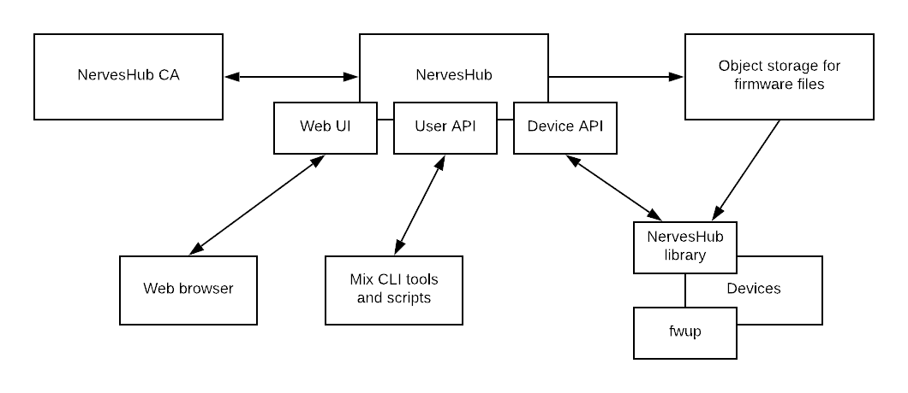

# Introduction


This documentation is being heavily written, edited and reorganized. Please continue to use the documentation in the README.md files in the NervesHub GitHub repositories.


NervesHub is an open-source firmware update server that works well with Nerves-based devices. A managed version is available at [nerves-hub.org](https://nerves-hub.org) and it's possible to host your own.

NervesHub provides many of the features that you'd expect in a firmware update server. Fundamentally, devices connect to the server either by polling at a pre-configured interval or by joining a long-lived [Phoenix channel](https://hexdocs.pm/phoenix/channels.html). If a firmware update is available, NervesHub provides a URL to the device and the device can update immediately or when convenient.

NervesHub leverages best practices and libraries from the Elixir community to provide a service that scales from hobbyist use to large scale industrial deployments. Since all components are open-source, there is no lock in. Extensive regression tests enable you to extend NervesHub with confidence if necessary. Of course, we hope that you will contribute improvements back.

Security is a primary concern of NervesHub:

* Cryptographic signatures on firmware updates provide end-to-end authentication
* Client-side and server-side SSL provide link authentication and encryption
* Access control within organizations to firmware updates

NervesHub provides the tools for safe remote updates. While it's not possible for the firmware update server alone to ensure that firmware updates are always safe, NervesHub does provide lightweight verification of firmware and detects misbehaving devices.

### High-level architecture

The following diagram shows the primary NervesHub components. 

The NervesHub server provides web and API endpoints for most interactions. The actual firmware storage and delivery resides on an object storage service such as AWS S3. 

While NervesHub could operate with many firmware update file formats in principle, it currently expects files using the format provided by [fwup](https://github.com/fhunleth/fwup). The fwup tool provides the low level packaging and application of firmware images. Firmware files are ZIP-formated files with metadata.

User interaction with NervesHub is through the web interface and via a CLI provided by an extension to Elixir's mix build tool. The CLI tools and their underlying User API endpoint are useful for automating common tasks.

Devices connect to NervesHub via a separate API endpoint that exposes only the functionality needed for firmware updates. For Nerves-based devices, the [nerves\_hub](https://github.com/nerves-hub/nerves_hub) library manages the interactions with the NervesHub server and invokes fwup to apply updates.

The final component is the NervesHub Certificate Authority \(CA\). This component issues the client-side SSL certificates for the User API. Devices also use client-side SSL, but those certificates are issued and managed by you, the user of NervesHub. 

### Public key infrastructure

NervesHub uses [asymmetric cryptography](https://en.wikipedia.org/wiki/Public-key_cryptography) for authenticating both sides of the connections to NervesHub and for end-to-end validation of firmware images. As with any use of asymmetric cryptography, a public key infrastructure \(PKI\) is required for establishing trust. The PKI for NervesHub is mostly managed by organizations using the service. Choices in NervesHub are intentionally compatible with other IoT services such as AWS IoT so that devices need only be provisioned with one private key rather than having a private key per service. There is no requirement that preventing devices from being issued many private keys, though.

####  Client-side SSL for devices

Before use, each device must be provisioned with a signed X.509 certificate and its associated private key. When devices connect to NervesHub they'll validate NervesHub's certificate. Likewise, NervesHub validates these client certificates.

Device certificates are signed by a Device CA certificate owned by you. You will register one or more Device CA certificates with NervesHub. The private keys associated with these certificates are never seen by NervesHub. If necessary, you can secure them in hardware security modules \(HSMs\). 

When a device connects for the first time, the device must present both its public certificate and the Device CA Certificate that signed it. Assuming that NervesHub knows the Device CA Certificate and that the Device Certificate has been signed properly, it will allow the device to connect. The Device Certificate is recorded on NervesHub to avoid verifying the chain of trust in the future. This also enables scenarios where Device CA Certificates have short validity time periods or are deleted once all devices signed by it have all connected. 

The NervesHub CLI tools provide convenience functions for creating certificates. It's also possible to use openssl or the Elixir [x509 library](https://hex.pm/packages/x509) directly. 

Care should be taken when handling the Device CA and device private keys. Compromised private keys can be used to access firmware updates and likely cause other mischief. Consider integrating a hardware storage chip into your device if it does not natively support secure storage. See [NervesKey](nerves-key/getting-started.md) for one solution.

#### Firmware update signatures

NervesHub requires cryptographic signatures on all firmware files. As opposed to the X.509 certificates used earlier, this functionality is provided by [libsodium's public key support](https://download.libsodium.org/doc/public-key_cryptography/public-key_signatures). The fwup commandline utility invokes libsodium to create key pairs, sign firmware update files, and verify signatures.

The public keys used to sign firmware update files must be uploaded to NervesHub and accessible to the device's firmware. By default, the NervesHub tooling embedded public keys in the device firmware. Both NervesHub and devices validate firmware signatures. The device validation is the important step since it ensures that the firmware that you generated is identical to the firmware being installed.

NervesHub requires users to register firmware public keys with it. This is used to catch mistakes that would otherwise waste time and bandwidth with deploying firmware that could never install correctly. 

Users should protect firmware signing keys. It is possible to register multiple firmware public keys on NervesHub and on devices. This allows more convenient setups where development devices can accept both "production" and "debug" firmware. Devices in the field, though, could have only the "production" public keys and therefore reject accidental deploys of "debug" firmware. Of course, NervesHub supports more mechanisms to group devices so relying on firmware signing keys can be considered a last resort.

