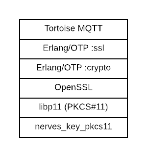

# MQTT integration

NervesKeys aren't only for use with NervesHub. If a service allows users to provide their own certificate authority, it should be possible to also use the NervesKey. Nearly all services use TLS or DTLS so these instructions provide guidance for using the [Erlang/OTP SSL application](http://erlang.org/doc/apps/ssl/users_guide.html). The following diagram shows the other compoents that are involved with establishing and authenticating MQTT connections over TLS:



In particular, the NervesKey integration with Erlang makes use of the [Engine API](http://erlang.org/doc/apps/crypto/engine_keys.html) to redirect private key operations to the cryptographic module. While `nerves_key_pkcs11` provides a PKCS\#11 implementation, be aware that it is minimal and only supports the operations necessary for establishing TLS connections. Programs using the NervesKey should still use the `nerves_key` library for provisioning and everything else.

To use the Erlang/OTP SSL application's Engine API, you will need to do the following:

1. Initialize the engine to start the `nerves_key_pkcs11` integration
2. Replace the locations where you would have suppliced a private key with an Elixir map that has a reference to the engine and other information

The `nerves_key_pkcs11`library has a helper functions for both tasks.

The following example code fragment shows how to start the Tortoise MQTT client API:

```text
{:ok, engine} = NervesKey.PKCS11.load_engine()
{:ok, i2c} = ATECC508A.Transport.I2C.init([])

signer_cert = X509.Certificate.to_der(NervesKey.signer_cert(i2c, :primary))
cert = X509.Certificate.to_der(NervesKey.device_cert(i2c, :primary))
key = NervesKey.PKCS11.private_key(engine, {:i2c, 1})
cacerts = [signer_cert | aws_root_certs()]

Tortoise.Supervisor.start_child(
  client_id: manufacturing_serial_number(),
  handler: {MQTTHandler, []},
  server: {
    Tortoise.Transport.SSL,
    verify: :verify_peer,
    host: mqtt_host(),
    port: mqtt_port(),
    alpn_advertised_protocols: alpn_advertised_protocols(),
    server_name_indication: server_name_indication(),
    cert: cert,
    key: key,
    cacerts: cacerts,
    versions: [:"tlsv1.2"]
  },
  subscriptions: topics()
 )
```

